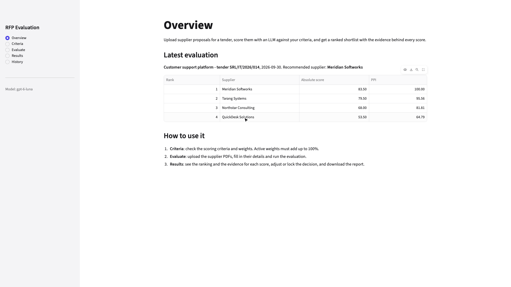
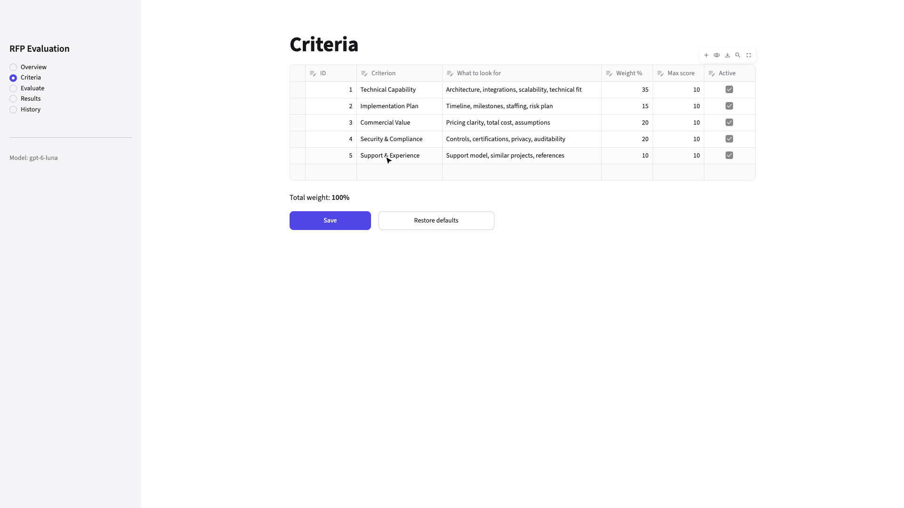
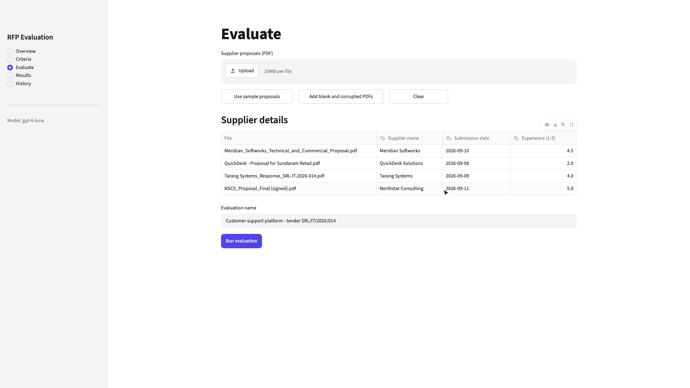
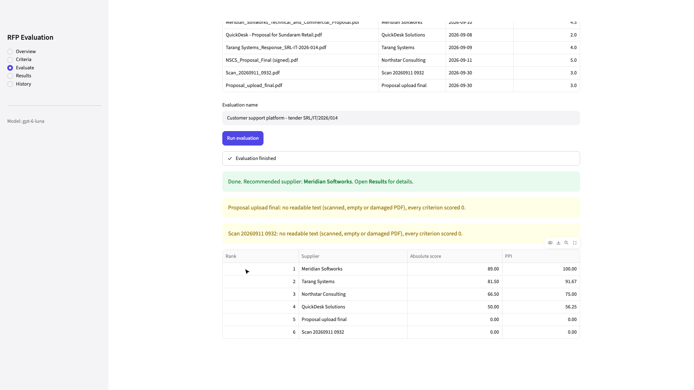
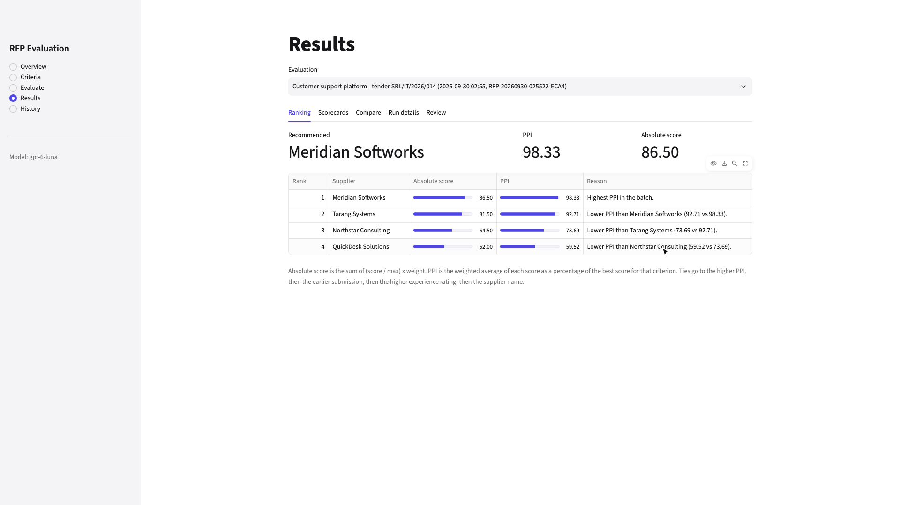
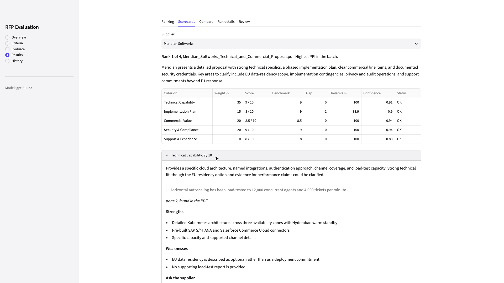
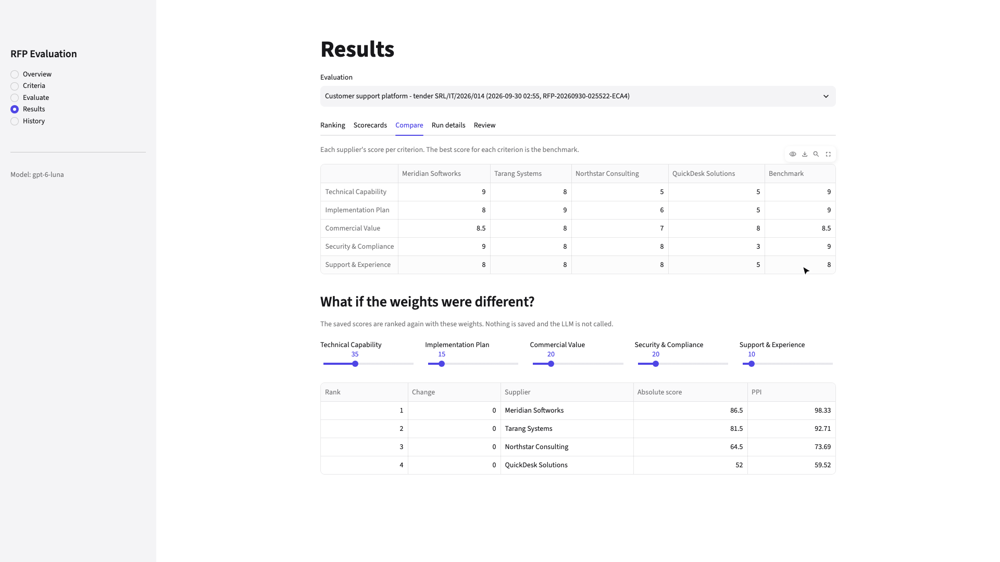
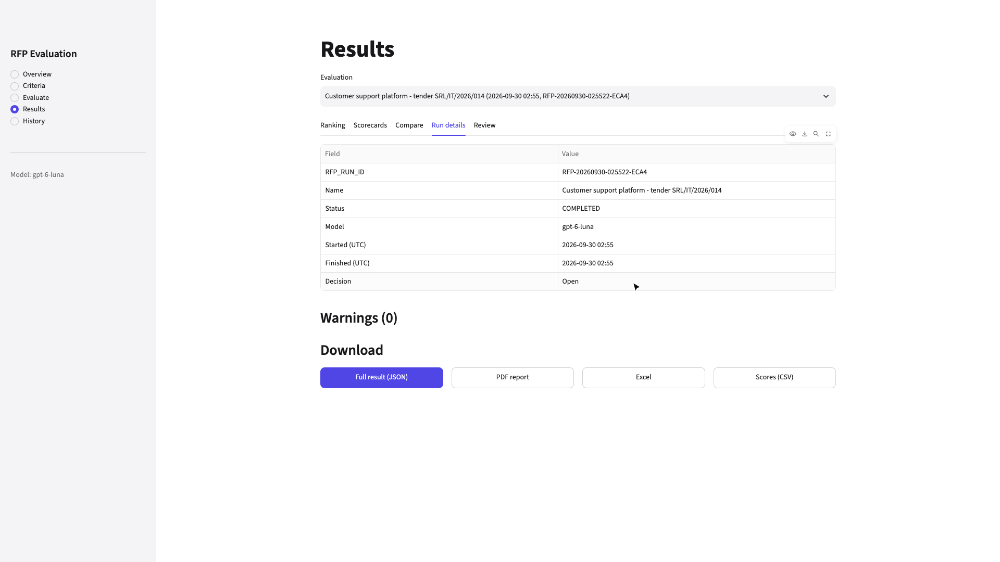
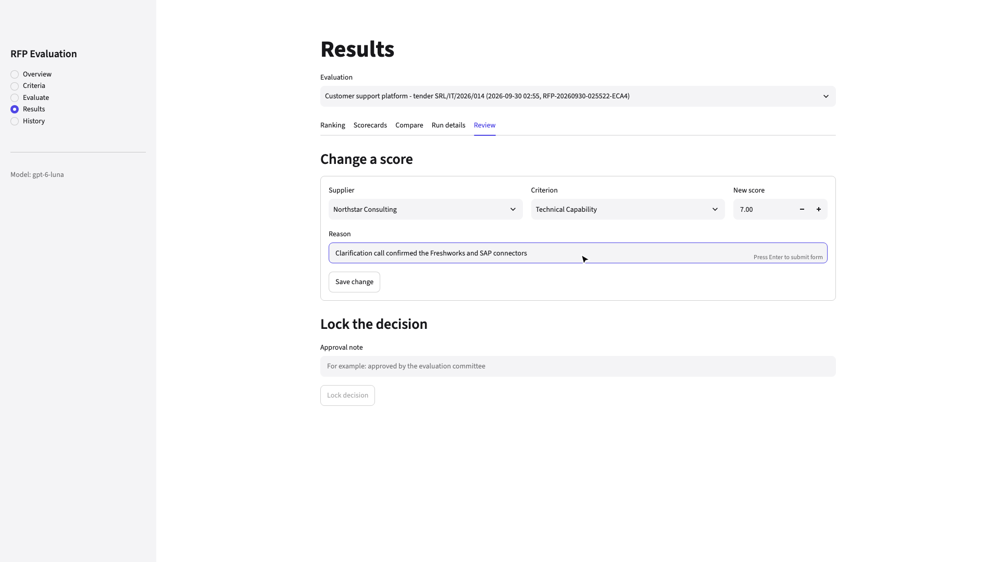
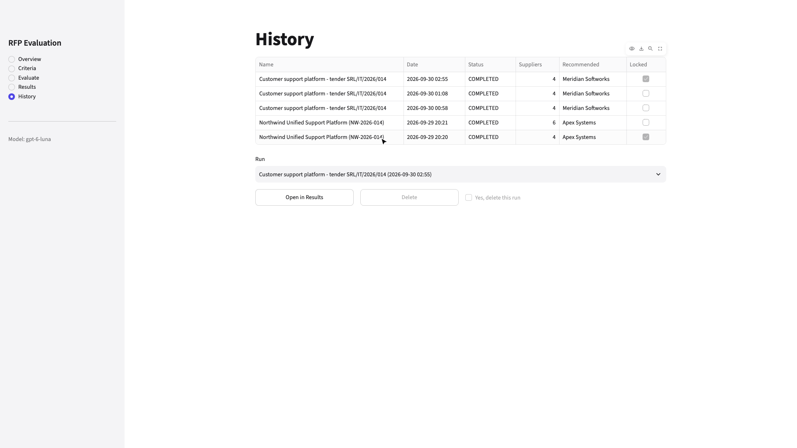

# RFP Evaluation

A Streamlit app that reads supplier proposals (PDF), asks an LLM to score each one against criteria stored in SQLite, and ranks the suppliers. The model only judges the content of each proposal. The weighted score, benchmark, gap, relative %, Peer Performance Index (PPI) and tie-breaks are worked out in plain Python.

- Live app: `https://<your-app>.streamlit.app` (add after deploying)
- Model: `gpt-6-luna` through LiteLLM, temperature 0, JSON output
- Stack: Streamlit, SQLite, LangGraph, LiteLLM, Pydantic, PyMuPDF, ReportLab, pytest
- Demo: `docs/demo.mp4`, a walk through every page: criteria check, a live run, each Results tab, a score change and lock, history, and a run with a blank and a corrupted PDF

## Run it
```bash
python -m venv .venv && source .venv/bin/activate
pip install -r requirements.txt
python db/seed.py
cp .streamlit/secrets.toml.example .streamlit/secrets.toml
streamlit run app.py
```
Put your LiteLLM settings (`LITELLM_API_KEY`, `LITELLM_API_BASE`, `LITELLM_MODEL`) in a `.env` file in the project folder or in `.streamlit/secrets.toml`. Both are git-ignored. Without a key the app scores proposals offline by keyword matching (mock mode), so every page still works.

## Project layout
```
app.py                  Streamlit pages: Overview, Criteria, Evaluate, Results, History
rfp_evaluation/
  extract.py            read the PDF text, find a quote in the PDF
  evaluate.py           prompt, LLM call, offline scorer
  validate.py           check and repair the LLM reply, check the inputs
  rank.py               scores, benchmark, PPI, tie-breaks, what-if
  run.py                the LangGraph workflow, score changes and locking
  store.py              SQLite queries
  export.py             PDF report and Excel workbook
db/
  tables.sql            table definitions
  seed.py               creates the database with the five sample criteria
tests/                  test_rank.py, test_validate.py, test_run.py
data/
  proposals/            four fictional supplier proposals in different formats
  bad_files/            a blank scan and a damaged PDF
  sample_run.json       one complete run
```

## How it maps to the brief
| Brief | Where |
|---|---|
| Orchestrator | `run.py`: `run_evaluation`, `batch_graph`, `supplier_graph` |
| Document tool | `extract.py`: `read_pdf`, `find_quote` |
| Evaluation agent | `evaluate.py`: `first_messages`, `ask_model` |
| Validation tool | `validate.py`: `Scorecard`, `clean_reply`, `check_inputs` |
| Ranking tool | `rank.py`: `rank`, `why_below`, `rank_with_weights` |
| Persistence | `store.py`, `db/tables.sql` |

## How a run works
1. The Evaluate page checks the inputs: at least two PDFs, unique supplier names, valid dates, experience rating from 1 to 5, no duplicate files, and active weights that add up to 100%.
2. A run is created with its own `RFP_RUN_ID` and the latest active criteria.
3. LangGraph handles every supplier in parallel: `extract` reads the PDF, `evaluate` asks the model for a JSON scorecard, `validate` checks the reply. If the reply is not JSON the model is asked once more. A PDF without text skips the model and scores 0.
4. `rank` works out the scores and the order, and `store` saves everything to SQLite.
5. On Results you can see the ranking, the evidence for each score, a comparison, the run details and the JSON download. A reviewer can change a score (a reason is required and logged) and lock the decision.

## Scoring
With weight w, max score m and checked score s for each active criterion:

| | Formula |
|---|---|
| Absolute score | sum of (s / m) x w, out of 100 |
| Benchmark | highest score for the criterion in the batch |
| Gap | s minus the benchmark |
| Relative % | s / benchmark x 100, or 0 when the benchmark is 0 |
| PPI | sum of (relative % x w) / sum of w |

Ties go to the higher PPI, then the earlier submission date, then the higher experience rating, then the supplier name A to Z. Ranks are given after this sort. Values are rounded to 4 decimals first so tiny float differences never decide a tie.

Example (from `tests/test_rank.py`): weights 50, 30 and 20. A scores 8, 6 and 10; B scores 10, 3 and 5. The benchmarks are 10, 6 and 10. A has an absolute score of 78 and a PPI of 90, B has 69 and 75, so A ranks first.

## Checks on the LLM reply
| In the reply | What happens |
|---|---|
| JSON inside text or a code block | the JSON is read |
| not JSON at all | asked once more, then every criterion scores 0 (INVALID) |
| a criterion missing | scored 0 (MISSING) |
| an unknown criterion | dropped with a warning |
| a score like "8/10" | read as 8 (COERCED) |
| a score outside 0 to max | clipped (CLIPPED) |
| confidence given as a percentage | turned into 0 to 1 |
| a quote not found in the PDF | kept, with a warning |

## Database
Four tables in `data/rfp_evaluation.db`:
- `evaluation_criteria`: name, description, weight, max score, active flag
- `rfp_runs`: one row per batch with status, model, the criteria used and the warnings
- `supplier_results`: one row per supplier per run with the scores, rank and the full scorecard as JSON
- `evaluation_events`: score changes and locks with the reason and the reviewer

## Sample data
A fictional tender: Sundaram Retail Pvt Ltd wants one customer support platform for 850 agents (tender SRL/IT/2026/014). Four suppliers replied, each in a different style, following the profiles in the brief:

| Supplier | File | Style | Profile |
|---|---|---|---|
| Meridian Softworks | `Meridian_Softworks_Technical_and_Commercial_Proposal.pdf` | formal proposal, cover page, contents, tables, 4 pages | strong technology and security, highest price |
| QuickDesk Solutions | `QuickDesk - Proposal for Sundaram Retail.pdf` | two-page letter from the founder | cheapest and fastest, weak on compliance and experience |
| Tarang Systems | `Tarang Systems_Response_SRL-IT-2026-014.pdf` | landscape slide deck, two-column slides | balanced, best implementation plan and support |
| Northstar Consulting | `NSCS_Proposal_Final (signed).pdf` | formal letter with annexures | strong references, integration details left "to be confirmed" |

`data/bad_files/` has a blank scan (`Scan_20260911_0932.pdf`) and a damaged PDF (`Proposal_upload_final.pdf`), used for the error case.

## Sample run
Run `RFP-20260930-005840-3595` with `gpt-6-luna` and weights Technical 35, Implementation 15, Commercial 20, Security 20, Support 10. It took about 20 seconds, every quote was found in its PDF and there were no warnings.

| Rank | Supplier | Absolute | PPI |
|---|---|---|---|
| 1 | Meridian Softworks | 85.50 | 97.75 |
| 2 | Tarang Systems | 79.50 | 91.08 |
| 3 | Northstar Consulting | 66.50 | 76.39 |
| 4 | QuickDesk Solutions | 54.50 | 63.17 |

The full result is in `data/sample_run.json`. The PDF report can be downloaded from the Run details tab.

## Tests
```bash
pytest
```
25 tests, no network calls: formulas and tie-breaks, reply checks, input checks, a full run in mock mode, blank and corrupted PDFs, the retry when the reply is not JSON, error messages that hide the key, score changes and locking, the exported files, and reading two-column slides.

## Assumptions and limits
- Active weights must add up to exactly 100. A criterion the model skips scores 0.
- Experience rating is on a 1 to 5 scale and submission dates cannot be in the future.
- Text is extracted, not OCR'd, so scanned PDFs score 0.
- The model's scores can differ between runs; everything after the reply is deterministic.
- On Streamlit Community Cloud the SQLite file resets when the app restarts. The criteria are seeded again on start.

## Deploy
1. Push to GitHub. `.gitignore` already leaves out the database, `.venv` and the secrets file.
2. On share.streamlit.io create an app with `app.py` as the main file.
3. Add `LITELLM_MODEL`, `LITELLM_API_BASE` and `LITELLM_API_KEY` in the app's Secrets.

## Screenshots
| | |
|---|---|
| Overview  | Criteria  |
| Evaluate  | Bad files  |
| Ranking  | Scorecard  |
| Compare  | Run details  |
| Review  | History  |
